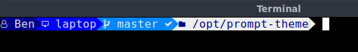

Prompt-Theme
============

A tool used to set the PS1 prompt using various themes.

Prompt-Theme should:

1) Make it a bit easier to set the prompt format
2) Create themes that are separate and sharable
3) Include additional features like git status in the prompt

Example:

Setup
-----

- Nerdfonts

  - https://www.nerdfonts.com

    - Provides different icons for use in themes
    - Required by the provided themes
    - Not required by the tool itself

  - After installing the fonts, you will need to configure your terminal to use the font

- Profile Setup

  - Download or clone the project and place in a common location (eg: /opt/prompt-theme)
  - Customize prompt.env (see below)
  - Test your changes! Run this command ::

    . prompt.env

  - Install the above command in your .profile, .bash_profile, or .bashrc depending on your system

- Profile Customization

  - The prompt.env file can be custmized completly, but the default is to configure the PROMPT_CUSTOMIZATION section.
  - You can override any of the variables found in the PROMPT_DEFAULT section

Theme File Layout
-----------------

- The theme file is in JSON format an contains a root-level array of layout sections
- All the provided themes are installed in the prompt-themes subdirectory
- Each section has these possible attributes, which are optional:

  - type

    - text

      - Print the given format and text value
      - Default if type is ommitted

    - reset

      - Reset all formatting

  - color

    - Allows these color types

      - Details in the 4-bit and 8-bit sections below
      - Color name

        - The name of the color
        - Names are not case sensitive

      - Color code

        - The color escape code without adjustment for foreground/background

      - Color rgb

        - The rgb value of the color
        - Only works for 8-bit depth
        - Non-matches will be adjusted to the nearest color
        - Example: rgb(0,0,0)

      - Color hex

        - The HTML-style hex color code
        - Only works for 8-bit depth
        - Example: #000000

    - Allows the effect code or name described in the section below

    - Can contain these attributes:

      - fg

        - Foreground color
        - Ommitting keeps the previous setting

      - bg

        - Background color
        - Ommitting keeps the previous setting

      - effect

        - The font effect
        - Ommitting keeps the previous setting

      - depth

        - The color lookup table to use (4bit or 8bit)
        - Defaults to 4 if ommitted

  - text

    - The text to print after applying formatting

Effects
-------

========= =====
 Name     Code
========= =====
NONE          0
BOLD          1
DIM           2
UNDERLINE     4
BLINK         5
INVERT        7
HIDDEN        8
========= =====

4-Bit Colors
------------

============= ====
 Name         Code
============= ====
Black            0
Red              1
Green            2
Yellow           3
Blue             4
Magenta          5
Cyan             6
Light gray       7
Dark gray       60
Light red       61
Light green     62
Light yellow    63
Light blue      64
Light magenta   65
Light cyan      66
White           67
============= ====

8-bit Colors
------------

- First hex/rgb code match from top is selected
- https://jonasjacek.github.io/colors/

Colors

================= ==== ================ =======
 Name             Code RGB              Hex
================= ==== ================ =======
Black                0 rgb(  0,  0,  0) #000000
Maroon               1 rgb(128,  0,  0) #800000
Green                2 rgb(  0,128,  0) #008000
Olive                3 rgb(128,128,  0) #808000
Navy                 4 rgb(  0,  0,128) #000080
Purple               5 rgb(128,  0,128) #800080
Teal                 6 rgb(  0,128,128) #008080
Grey                 8 rgb(128,128,128) #808080
Red                  9 rgb(255,  0,  0) #ff0000
Lime                10 rgb(  0,255,  0) #00ff00
Yellow              11 rgb(255,255,  0) #ffff00
Blue                12 rgb(  0,  0,255) #0000ff
Fuchsia             13 rgb(255,  0,255) #ff00ff
Aqua                14 rgb(  0,255,255) #00ffff
White               15 rgb(255,255,255) #ffffff
Grey0               16 rgb(  0,  0,  0) #000000
NavyBlue            17 rgb(  0,  0, 95) #00005f
DarkBlue            18 rgb(  0,  0,135) #000087
Blue3               19 rgb(  0,  0,175) #0000af
Blue3               20 rgb(  0,  0,215) #0000d7
Blue1               21 rgb(  0,  0,255) #0000ff
DarkGreen           22 rgb(  0, 95,  0) #005f00
DeepSkyBlue4        23 rgb(  0, 95, 95) #005f5f
DeepSkyBlue4        24 rgb(  0, 95,135) #005f87
DeepSkyBlue4        25 rgb(  0, 95,175) #005faf
DodgerBlue3         26 rgb(  0, 95,215) #005fd7
DodgerBlue2         27 rgb(  0, 95,255) #005fff
Green4              28 rgb(  0,135,  0) #008700
SpringGreen4        29 rgb(  0,135, 95) #00875f
Turquoise4          30 rgb(  0,135,135) #008787
DeepSkyBlue3        31 rgb(  0,135,175) #0087af
DeepSkyBlue3        32 rgb(  0,135,215) #0087d7
DodgerBlue1         33 rgb(  0,135,255) #0087ff
Green3              34 rgb(  0,175,  0) #00af00
SpringGreen3        35 rgb(  0,175, 95) #00af5f
DarkCyan            36 rgb(  0,175,135) #00af87
LightSeaGreen       37 rgb(  0,175,175) #00afaf
DeepSkyBlue2        38 rgb(  0,175,215) #00afd7
DeepSkyBlue1        39 rgb(  0,175,255) #00afff
Green3              40 rgb(  0,215,  0) #00d700
SpringGreen3        41 rgb(  0,215, 95) #00d75f
SpringGreen2        42 rgb(  0,215,135) #00d787
Cyan3               43 rgb(  0,215,175) #00d7af
DarkTurquoise       44 rgb(  0,215,215) #00d7d7
Turquoise2          45 rgb(  0,215,255) #00d7ff
Green1              46 rgb(  0,255,  0) #00ff00
SpringGreen2        47 rgb(  0,255, 95) #00ff5f
SpringGreen1        48 rgb(  0,255,135) #00ff87
MediumSpringGreen   49 rgb(  0,255,175) #00ffaf
Cyan2               50 rgb(  0,255,215) #00ffd7
Cyan1               51 rgb(  0,255,255) #00ffff
DarkRed             52 rgb( 95,  0,  0) #5f0000
DeepPink4           53 rgb( 95,  0, 95) #5f005f
Purple4             54 rgb( 95,  0,135) #5f0087
Purple4             55 rgb( 95,  0,175) #5f00af
Purple3             56 rgb( 95,  0,215) #5f00d7
BlueViolet          57 rgb( 95,  0,255) #5f00ff
Orange4             58 rgb( 95, 95,  0) #5f5f00
Grey37              59 rgb( 95, 95, 95) #5f5f5f
MediumPurple4       60 rgb( 95, 95,135) #5f5f87
SlateBlue3          61 rgb( 95, 95,175) #5f5faf
SlateBlue3          62 rgb( 95, 95,215) #5f5fd7
RoyalBlue1          63 rgb( 95, 95,255) #5f5fff
Chartreuse4         64 rgb( 95,135,  0) #5f8700
DarkSeaGreen4       65 rgb( 95,135, 95) #5f875f
PaleTurquoise4      66 rgb( 95,135,135) #5f8787
SteelBlue           67 rgb( 95,135,175) #5f87af
SteelBlue3          68 rgb( 95,135,215) #5f87d7
CornflowerBlue      69 rgb( 95,135,255) #5f87ff
Chartreuse3         70 rgb( 95,175,  0) #5faf00
DarkSeaGreen4       71 rgb( 95,175, 95) #5faf5f
CadetBlue           72 rgb( 95,175,135) #5faf87
CadetBlue           73 rgb( 95,175,175) #5fafaf
SkyBlue3            74 rgb( 95,175,215) #5fafd7
SteelBlue1          75 rgb( 95,175,255) #5fafff
Chartreuse3         76 rgb( 95,215,  0) #5fd700
PaleGreen3          77 rgb( 95,215, 95) #5fd75f
SeaGreen3           78 rgb( 95,215,135) #5fd787
Aquamarine3         79 rgb( 95,215,175) #5fd7af
MediumTurquoise     80 rgb( 95,215,215) #5fd7d7
SteelBlue1          81 rgb( 95,215,255) #5fd7ff
Chartreuse2         82 rgb( 95,255,  0) #5fff00
SeaGreen2           83 rgb( 95,255, 95) #5fff5f
SeaGreen1           84 rgb( 95,255,135) #5fff87
SeaGreen1           85 rgb( 95,255,175) #5fffaf
Aquamarine1         86 rgb( 95,255,215) #5fffd7
DarkSlateGray2      87 rgb( 95,255,255) #5fffff
DarkRed             88 rgb(135,  0,  0) #870000
DeepPink4           89 rgb(135,  0, 95) #87005f
DarkMagenta         90 rgb(135,  0,135) #870087
DarkMagenta         91 rgb(135,  0,175) #8700af
DarkViolet          92 rgb(135,  0,215) #8700d7
Purple              93 rgb(135,  0,255) #8700ff
Orange4             94 rgb(135, 95,  0) #875f00
LightPink4          95 rgb(135, 95, 95) #875f5f
Plum4               96 rgb(135, 95,135) #875f87
MediumPurple3       97 rgb(135, 95,175) #875faf
MediumPurple3       98 rgb(135, 95,215) #875fd7
SlateBlue1          99 rgb(135, 95,255) #875fff
Yellow4            100 rgb(135,135,  0) #878700
Wheat4             101 rgb(135,135, 95) #87875f
Grey53             102 rgb(135,135,135) #878787
LightSlateGrey     103 rgb(135,135,175) #8787af
MediumPurple       104 rgb(135,135,215) #8787d7
LightSlateBlue     105 rgb(135,135,255) #8787ff
Yellow4            106 rgb(135,175,  0) #87af00
DarkOliveGreen3    107 rgb(135,175, 95) #87af5f
DarkSeaGreen       108 rgb(135,175,135) #87af87
LightSkyBlue3      109 rgb(135,175,175) #87afaf
LightSkyBlue3      110 rgb(135,175,215) #87afd7
SkyBlue2           111 rgb(135,175,255) #87afff
Chartreuse2        112 rgb(135,215,  0) #87d700
DarkOliveGreen3    113 rgb(135,215, 95) #87d75f
PaleGreen3         114 rgb(135,215,135) #87d787
DarkSeaGreen3      115 rgb(135,215,175) #87d7af
DarkSlateGray3     116 rgb(135,215,215) #87d7d7
SkyBlue1           117 rgb(135,215,255) #87d7ff
Chartreuse1        118 rgb(135,255,  0) #87ff00
LightGreen         119 rgb(135,255, 95) #87ff5f
LightGreen         120 rgb(135,255,135) #87ff87
PaleGreen1         121 rgb(135,255,175) #87ffaf
Aquamarine1        122 rgb(135,255,215) #87ffd7
DarkSlateGray1     123 rgb(135,255,255) #87ffff
Red3               124 rgb(175,  0,  0) #af0000
DeepPink4          125 rgb(175,  0, 95) #af005f
MediumVioletRed    126 rgb(175,  0,135) #af0087
Magenta3           127 rgb(175,  0,175) #af00af
DarkViolet         128 rgb(175,  0,215) #af00d7
Purple             129 rgb(175,  0,255) #af00ff
DarkOrange3        130 rgb(175, 95,  0) #af5f00
IndianRed          131 rgb(175, 95, 95) #af5f5f
HotPink3           132 rgb(175, 95,135) #af5f87
MediumOrchid3      133 rgb(175, 95,175) #af5faf
MediumOrchid       134 rgb(175, 95,215) #af5fd7
MediumPurple2      135 rgb(175, 95,255) #af5fff
DarkGoldenrod      136 rgb(175,135,  0) #af8700
LightSalmon3       137 rgb(175,135, 95) #af875f
RosyBrown          138 rgb(175,135,135) #af8787
Grey63             139 rgb(175,135,175) #af87af
MediumPurple2      140 rgb(175,135,215) #af87d7
MediumPurple1      141 rgb(175,135,255) #af87ff
Gold3              142 rgb(175,175,  0) #afaf00
DarkKhaki          143 rgb(175,175, 95) #afaf5f
NavajoWhite3       144 rgb(175,175,135) #afaf87
Grey69             145 rgb(175,175,175) #afafaf
LightSteelBlue3    146 rgb(175,175,215) #afafd7
LightSteelBlue     147 rgb(175,175,255) #afafff
Yellow3            148 rgb(175,215,  0) #afd700
DarkOliveGreen3    149 rgb(175,215, 95) #afd75f
DarkSeaGreen3      150 rgb(175,215,135) #afd787
DarkSeaGreen2      151 rgb(175,215,175) #afd7af
LightCyan3         152 rgb(175,215,215) #afd7d7
LightSkyBlue1      153 rgb(175,215,255) #afd7ff
GreenYellow        154 rgb(175,255,  0) #afff00
DarkOliveGreen2    155 rgb(175,255, 95) #afff5f
PaleGreen1         156 rgb(175,255,135) #afff87
DarkSeaGreen2      157 rgb(175,255,175) #afffaf
DarkSeaGreen1      158 rgb(175,255,215) #afffd7
PaleTurquoise1     159 rgb(175,255,255) #afffff
Red3               160 rgb(215,  0,  0) #d70000
DeepPink3          161 rgb(215,  0, 95) #d7005f
DeepPink3          162 rgb(215,  0,135) #d70087
Magenta3           163 rgb(215,  0,175) #d700af
Magenta3           164 rgb(215,  0,215) #d700d7
Magenta2           165 rgb(215,  0,255) #d700ff
DarkOrange3        166 rgb(215, 95,  0) #d75f00
IndianRed          167 rgb(215, 95, 95) #d75f5f
HotPink3           168 rgb(215, 95,135) #d75f87
HotPink2           169 rgb(215, 95,175) #d75faf
Orchid             170 rgb(215, 95,215) #d75fd7
MediumOrchid1      171 rgb(215, 95,255) #d75fff
Orange3            172 rgb(215,135,  0) #d78700
LightSalmon3       173 rgb(215,135, 95) #d7875f
LightPink3         174 rgb(215,135,135) #d78787
Pink3              175 rgb(215,135,175) #d787af
Plum3              176 rgb(215,135,215) #d787d7
Violet             177 rgb(215,135,255) #d787ff
Gold3              178 rgb(215,175,  0) #d7af00
LightGoldenrod3    179 rgb(215,175, 95) #d7af5f
Tan                180 rgb(215,175,135) #d7af87
MistyRose3         181 rgb(215,175,175) #d7afaf
Thistle3           182 rgb(215,175,215) #d7afd7
Plum2              183 rgb(215,175,255) #d7afff
Yellow3            184 rgb(215,215,  0) #d7d700
Khaki3             185 rgb(215,215, 95) #d7d75f
LightGoldenrod2    186 rgb(215,215,135) #d7d787
LightYellow3       187 rgb(215,215,175) #d7d7af
Grey84             188 rgb(215,215,215) #d7d7d7
LightSteelBlue1    189 rgb(215,215,255) #d7d7ff
Yellow2            190 rgb(215,255,  0) #d7ff00
DarkOliveGreen1    191 rgb(215,255, 95) #d7ff5f
DarkOliveGreen1    192 rgb(215,255,135) #d7ff87
DarkSeaGreen1      193 rgb(215,255,175) #d7ffaf
Honeydew2          194 rgb(215,255,215) #d7ffd7
LightCyan1         195 rgb(215,255,255) #d7ffff
Red1               196 rgb(255,  0,  0) #ff0000
DeepPink2          197 rgb(255,  0, 95) #ff005f
DeepPink1          198 rgb(255,  0,135) #ff0087
DeepPink1          199 rgb(255,  0,175) #ff00af
Magenta2           200 rgb(255,  0,215) #ff00d7
Magenta1           201 rgb(255,  0,255) #ff00ff
OrangeRed1         202 rgb(255, 95,  0) #ff5f00
IndianRed1         203 rgb(255, 95, 95) #ff5f5f
IndianRed1         204 rgb(255, 95,135) #ff5f87
HotPink            205 rgb(255, 95,175) #ff5faf
HotPink            206 rgb(255, 95,215) #ff5fd7
MediumOrchid1      207 rgb(255, 95,255) #ff5fff
DarkOrange         208 rgb(255,135,  0) #ff8700
Salmon1            209 rgb(255,135, 95) #ff875f
LightCoral         210 rgb(255,135,135) #ff8787
PaleVioletRed1     211 rgb(255,135,175) #ff87af
Orchid2            212 rgb(255,135,215) #ff87d7
Orchid1            213 rgb(255,135,255) #ff87ff
Orange1            214 rgb(255,175,  0) #ffaf00
SandyBrown         215 rgb(255,175, 95) #ffaf5f
LightSalmon1       216 rgb(255,175,135) #ffaf87
LightPink1         217 rgb(255,175,175) #ffafaf
Pink1              218 rgb(255,175,215) #ffafd7
Plum1              219 rgb(255,175,255) #ffafff
Gold1              220 rgb(255,215,  0) #ffd700
LightGoldenrod2    221 rgb(255,215, 95) #ffd75f
LightGoldenrod2    222 rgb(255,215,135) #ffd787
NavajoWhite1       223 rgb(255,215,175) #ffd7af
MistyRose1         224 rgb(255,215,215) #ffd7d7
Thistle1           225 rgb(255,215,255) #ffd7ff
Yellow1            226 rgb(255,255,  0) #ffff00
LightGoldenrod1    227 rgb(255,255, 95) #ffff5f
Khaki1             228 rgb(255,255,135) #ffff87
Wheat1             229 rgb(255,255,175) #ffffaf
Cornsilk1          230 rgb(255,255,215) #ffffd7
Grey100            231 rgb(255,255,255) #ffffff

================= ==== ================ =======

Greys

================= ==== ================ =======
 Name             Code RGB              Hex
================= ==== ================ =======
Silver               7 rgb(192,192,192) #c0c0c0
Grey3              232 rgb(  8,  8,  8) #080808
Grey7              233 rgb( 18, 18, 18) #121212
Grey11             234 rgb( 28, 28, 28) #1c1c1c
Grey15             235 rgb( 38, 38, 38) #262626
Grey19             236 rgb( 48, 48, 48) #303030
Grey23             237 rgb( 58, 58, 58) #3a3a3a
Grey27             238 rgb( 68, 68, 68) #444444
Grey30             239 rgb( 78, 78, 78) #4e4e4e
Grey35             240 rgb( 88, 88, 88) #585858
Grey39             241 rgb( 98, 98, 98) #626262
Grey42             242 rgb(108,108,108) #6c6c6c
Grey46             243 rgb(118,118,118) #767676
Grey50             244 rgb(128,128,128) #808080
Grey54             245 rgb(138,138,138) #8a8a8a
Grey58             246 rgb(148,148,148) #949494
Grey62             247 rgb(158,158,158) #9e9e9e
Grey66             248 rgb(168,168,168) #a8a8a8
Grey70             249 rgb(178,178,178) #b2b2b2
Grey74             250 rgb(188,188,188) #bcbcbc
Grey78             251 rgb(198,198,198) #c6c6c6
Grey82             252 rgb(208,208,208) #d0d0d0
Grey85             253 rgb(218,218,218) #dadada
Grey89             254 rgb(228,228,228) #e4e4e4
Grey93             255 rgb(238,238,238) #eeeeee
================= ==== ================ =======
